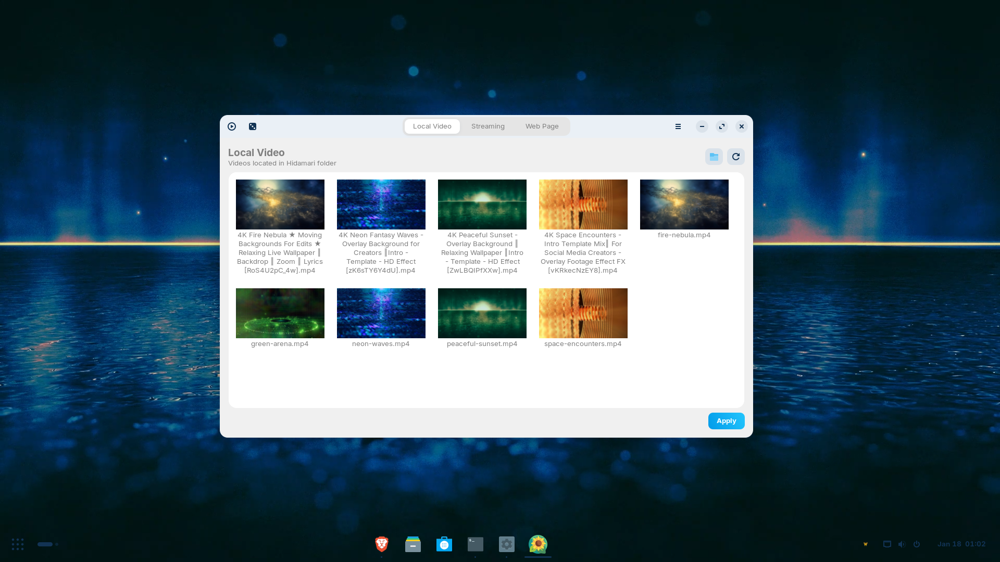

# Waller

Live animated wallpapers for GNOME (X11) using Hidamari.

## Screenshot



██║ █╗ ██║███████║██║     ██║     █████╗  ██████╔╝
██║███╗██║██╔══██║██║     ██║     ██╔══╝  ██╔══██╗
╚███╔███╔╝██║  ██║███████╗███████╗███████╗██║  ██║
 ╚══╝╚══╝ ╚═╝  ╚═╝╚══════╝╚══════╝╚══════╝╚═╝  ╚═╝
                                                                                              
# WALLER

Animated live wallpapers for GNOME (X11), powered by Hidamari
*Lively Wallpaper–style experience on Linux*

---

## 1. What is Waller?

**Waller** is a lightweight, open-source Linux application that lets you run **animated video wallpapers** on the desktop, similar to **Lively Wallpaper on Windows**.

Design goals:

* Tray-only by default (no clutter)
* Clean GTK GUI opened on demand
* One-click “Apply” for wallpapers
* Video loop wallpapers (MP4 / MKV / WEBM)
* No visible controls, overlays, or flashes
* GNOME-friendly (tested on Zorin OS, X11)
* No bundled videos, no large binaries
* Uses **Hidamari** (Flatpak) as the backend renderer

Waller does **not** re-implement video wallpaper rendering.
It acts as a **controller + UX layer** over Hidamari.

---

## 2. System Requirements

### Required

* Linux
* GNOME desktop
* **X11/Xorg session** (Wayland currently unsupported by Hidamari)
* Python **3.10+**
* Flatpak
* Internet connection (first-time setup)

### Tested on

* Zorin OS (GNOME-based)
* Ubuntu-based distros
* X11 session

---

## 3. Architecture Overview (important)

Waller consists of **three layers**:

1. **Tray + GUI (Python / GTK)**

   * Tray icon (Open / Exit)
   * Settings window
   * Drag-and-drop local videos
   * Default wallpapers list

2. **API Bridge**

   * Writes Hidamari configuration
   * Restarts Hidamari cleanly
   * No mpv / xwinwrap hacks
   * No guessing state

3. **Hidamari (Flatpak)**

   * Does the actual wallpaper rendering
   * Uses mpv + ffmpeg inside sandbox
   * Integrates with GNOME wallpaper system

This separation is intentional and stable.

---

## 4. Install Dependencies

### 4.1 System packages

```bash
sudo apt update
sudo apt install -y \
  python3 \
  python3-venv \
  python3-pip \
  gir1.2-appindicator3-0.1 \
  libcanberra-gtk3-module
```

> `libcanberra-gtk3-module` is optional but removes harmless GTK warnings.

---

### 4.2 Flatpak + Flathub

```bash
sudo apt install -y flatpak
flatpak remote-add --if-not-exists flathub https://flathub.org/repo/flathub.flatpakrepo
```

Log out and back in once if Flatpak is newly installed.

---

## 5. Install Hidamari (Wallpaper Engine)

```bash
flatpak install flathub io.github.jeffshee.Hidamari
```

### IMPORTANT: Install full codecs (required)

Hidamari runs on **GNOME Platform 48**, which maps to **Freedesktop 23.08**.

You must install:

```bash
flatpak install flathub org.freedesktop.Platform.ffmpeg-full//23.08
```

Without this, videos will silently fail.

---

## 6. Reset Hidamari Config (critical first-run fix)

Hidamari may crash on first launch due to stale config.

Run once:

```bash
rm -rf ~/.var/app/io.github.jeffshee.Hidamari
flatpak run io.github.jeffshee.Hidamari
```

Wait until it starts, then close it.

This step **prevents a known Hidamari crash**.

---

## 7. Flatpak File Permissions (critical)

Hidamari **cannot access arbitrary folders**.

By default, it can only read:

```
~/Videos/Hidamari/
```

Grant access explicitly:

```bash
flatpak override --user --filesystem=xdg-videos io.github.jeffshee.Hidamari
```

---

## 8. Prepare Wallpaper Videos

### 8.1 Create the required directory

```bash
mkdir -p ~/Videos/Hidamari
```

### 8.2 Download default wallpapers (example)

Waller does **not** ship videos.

Use `yt-dlp` (or similar):

```bash
yt-dlp -f "bestvideo[ext=mp4]/best" -o "~/Videos/Hidamari/green-arena.mp4" https://www.youtube.com/watch?v=rRNWW38WgGs
yt-dlp -f "bestvideo[ext=mp4]/best" -o "~/Videos/Hidamari/fire-nebula.mp4" https://www.youtube.com/watch?v=RoS4U2pC_4w
yt-dlp -f "bestvideo[ext=mp4]/best" -o "~/Videos/Hidamari/neon-waves.mp4" https://www.youtube.com/watch?v=zK6sTY6Y4dU
yt-dlp -f "bestvideo[ext=mp4]/best" -o "~/Videos/Hidamari/peaceful-sunset.mp4" https://www.youtube.com/watch?v=ZwLBQIPfXXw
yt-dlp -f "bestvideo[ext=mp4]/best" -o "~/Videos/Hidamari/space-encounters.mp4" https://www.youtube.com/watch?v=vKRkecNzEY8
```

Supported formats:

* `.mp4`
* `.mkv`
* `.webm`

---

## 9. Install Waller (Developer Mode)

From the project root:

```bash
cd ~/Desktop/waller
python3 -m venv .venv
source .venv/bin/activate
pip install -r requirements.txt
```

---

## 10. Running Waller

### Start tray mode (recommended)

```bash
cd ~/Desktop/waller
python3 -m waller.tray
```

You will see:

* A **W icon** in the system tray
* Right-click menu:

  * **Open** → opens GUI
  * **Exit** → quits Waller

### Apply a wallpaper

1. Tray → **Open**
2. Click **Apply** on a default wallpaper
   OR drag a local video into the lower pane and click Apply
3. Wallpaper animates on the desktop

No extra windows. No player UI.

---

## 11. Drag & Drop Local Videos

* Drag video files directly into the **Local videos** pane
* Files are remembered for the session
* Clicking **Apply** immediately sets them as wallpaper
* No file chooser popups
* No external video players launched

---

## 12. Known Limitations (by design)

* Wayland is **not supported** yet (GNOME restriction)
* Per-monitor wallpapers not implemented (planned)
* No 3D / interactive scenes yet
* No automatic video download inside the app
* Flatpak sandbox limits video locations

---

## 13. Troubleshooting

### Wallpaper does not appear

* Ensure:

  * X11 session (not Wayland)
  * Videos are in `~/Videos/Hidamari`
  * ffmpeg-full **23.08** is installed
  * Hidamari config was reset once

### Check Hidamari directly

```bash
flatpak run io.github.jeffshee.Hidamari
```

If it crashes, fix Hidamari first — Waller depends on it.

### Verify codec install

```bash
flatpak list | grep ffmpeg
```

Must show:

```
org.freedesktop.Platform.ffmpeg-full 23.08
```

---

## 14. Project Philosophy

* No hidden services
* No kernel hacks
* No wallpaper flashing
* No proprietary lock-in
* No bloated UI
* Respect Flatpak sandboxing

Waller does **one job**:
make animated wallpapers feel native on Linux.

---

## 15. License

MIT License
Use it, fork it, extend it.

---

## 16. Roadmap (optional)

* Autostart support
* Per-monitor wallpapers
* Pause on fullscreen apps
* Wayland backend (when possible)
* Interactive / shader-based scenes

# Waller

Live animated wallpapers for GNOME (X11) using Hidamari.

## What it does
- Tray-based controller
- Simple GUI to apply wallpapers
- Uses Hidamari + mpv for reliable GNOME support

## What it does NOT do
- Does not bundle videos
- Does not replace Hidamari
- Wayland not supported (yet)

## Requirements
- GNOME (X11)
- Flatpak
- Hidamari (Flathub)

## Install
(flatpak commands + python run)

## Known limitations
- Hidamari UI may appear
- First-time config reset may be required


---

**End of README**

